# turtle画布计算巢快速部署

>**免责声明：**本服务由第三方提供，我们尽力确保其安全性、准确性和可靠性，但无法保证其完全免于故障、中断、错误或攻击。因此，本公司在此声明：对于本服务的内容、准确性、完整性、可靠性、适用性以及及时性不作任何陈述、保证或承诺，不对您使用本服务所产生的任何直接或间接的损失或损害承担任何责任；对于您通过本服务访问的第三方网站、应用程序、产品和服务，不对其内容、准确性、完整性、可靠性、适用性以及及时性承担任何责任，您应自行承担使用后果产生的风险和责任；对于因您使用本服务而产生的任何损失、损害，包括但不限于直接损失、间接损失、利润损失、商誉损失、数据损失或其他经济损失，不承担任何责任，即使本公司事先已被告知可能存在此类损失或损害的可能性；我们保留不时修改本声明的权利，因此请您在使用本服务前定期检查本声明。如果您对本声明或本服务存在任何问题或疑问，请联系我们。

## 概述

turtle库是Python语言中自带的一个用于绘制图像的函数库。turtle库为使用者提供一个或多个小乌龟作为画笔，使用者可通过turtle库提供的各种方法去控制小乌龟在一个平面直角坐标系中移动并绘制移动轨迹以画出想要的图案。

## 计费说明

turtle画布上的费用主要涉及：

- 所选vCPU与内存规格
- 系统盘类型及容量
- 公网带宽

## 部署架构

## RAM账号所需权限

部署turtle画布服务实例，需要对部分阿里云资源进行访问和创建操作。因此您的账号需要包含如下资源的权限。
  **说明**：当您的账号是RAM账号时，才需要添加此权限。

| 权限策略名称                          | 备注                     |
|---------------------------------|------------------------|
| AliyunECSFullAccess             | 管理云服务器服务（ECS）的权限       |
| AliyunVPCFullAccess             | 管理专有网络（VPC）的权限         |
| AliyunROSFullAccess             | 管理资源编排服务（ROS）的权限       |
| AliyunComputeNestUserFullAccess | 管理计算巢服务（ComputeNest）的用户侧权限 |

## 部署流程

1. 访问计算巢turtle画布[部署链接](https://computenest.console.aliyun.com/service/instance/create/cn-hangzhou?spm=5176.24779694.0.0.2dc44d22bKq8lF&type=user&ServiceId=service-06f25f1b35084a379977)
，按提示填写部署参数：

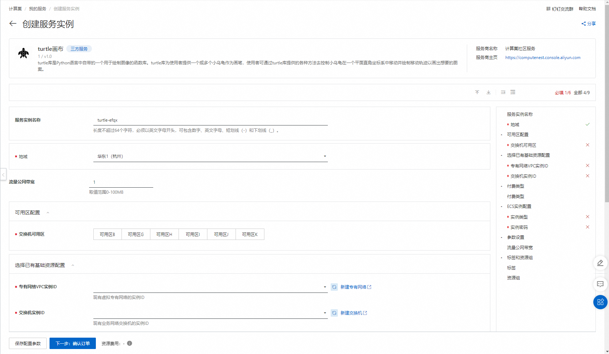

2. 参数填写完成后可以看到对应询价明细，确认参数后点击**下一步：确认订单**。

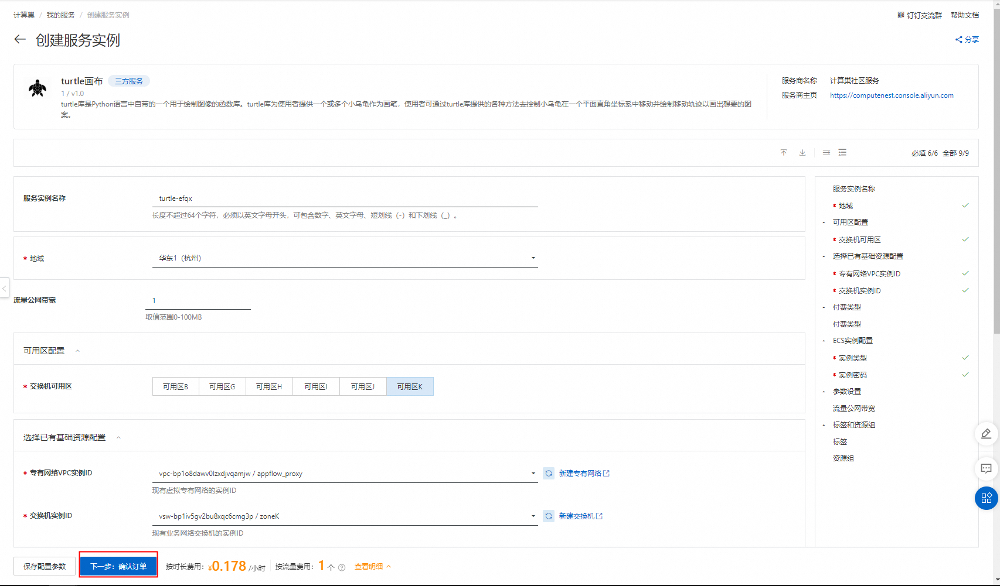

3. 确认订单完成后同意服务协议并点击**立即创建**进入部署阶段。

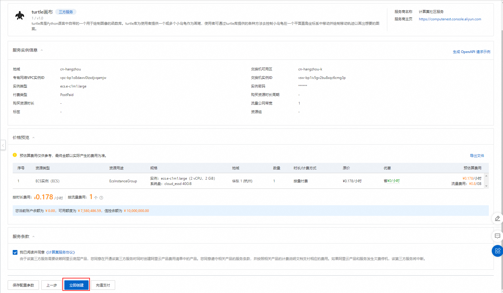

4. 等待部署完成后进入服务实例管理，选择资源点击实例的资源ID。

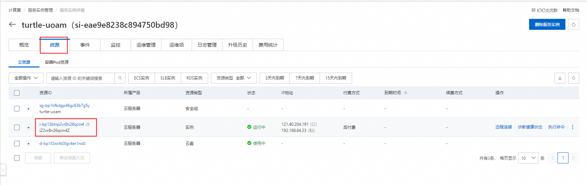

5. 通过VNC远程连接机器。

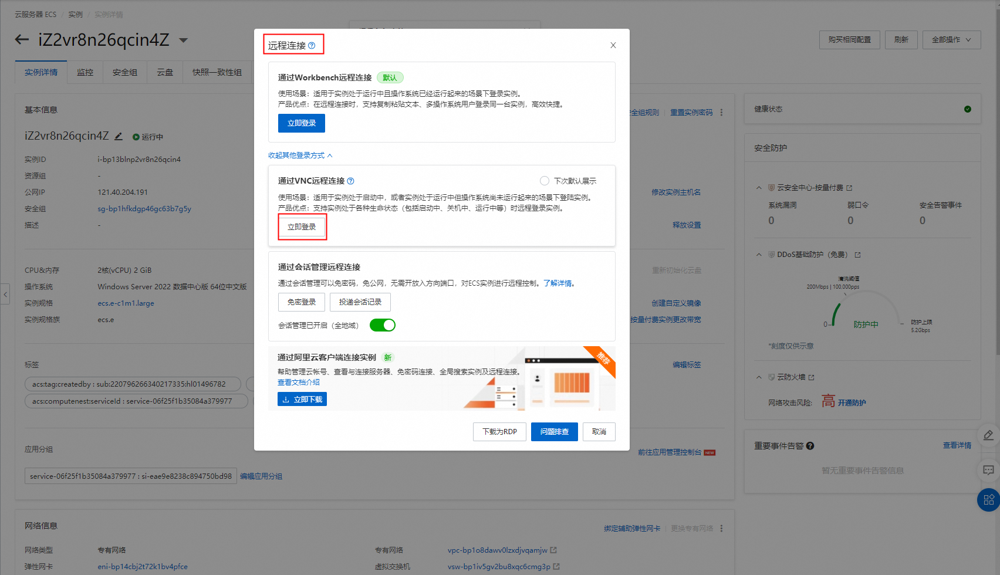
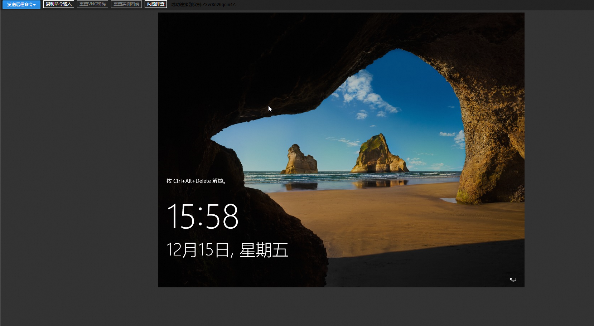

6. 解锁远程页面并登录机器。

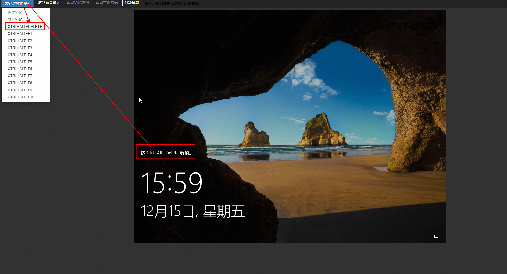

7. 运行python代码画图。

> 在桌面上可以看到3个.py文件，双击运行，即可看到代码对应画出的圣诞树。

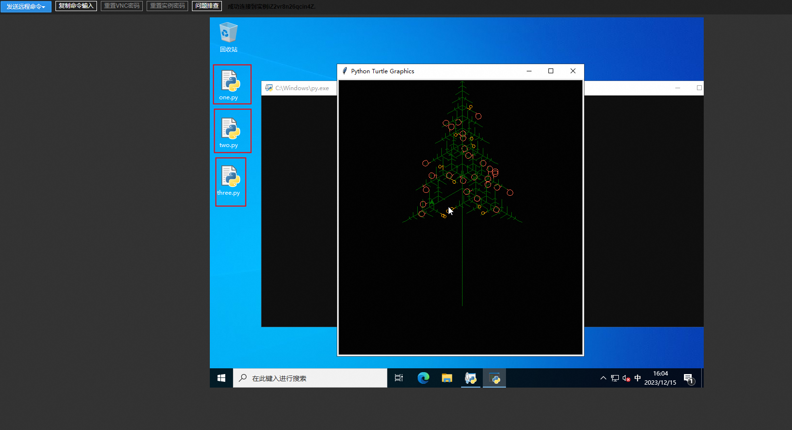

8. 启动flask服务，外网访问圣诞树图片。

> 进入C:\Users\Administrator\Documents文件，cmd运行命令：python test.py启动flask框架，通过公网IP可外网访问生成的圣诞树图片。

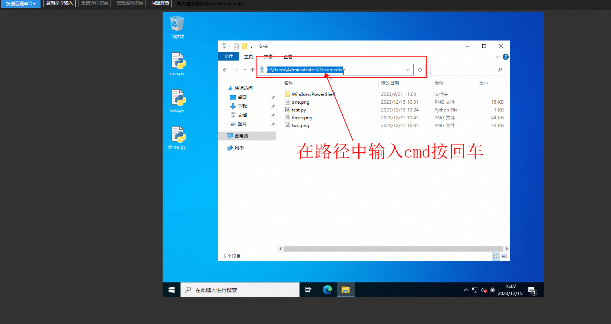
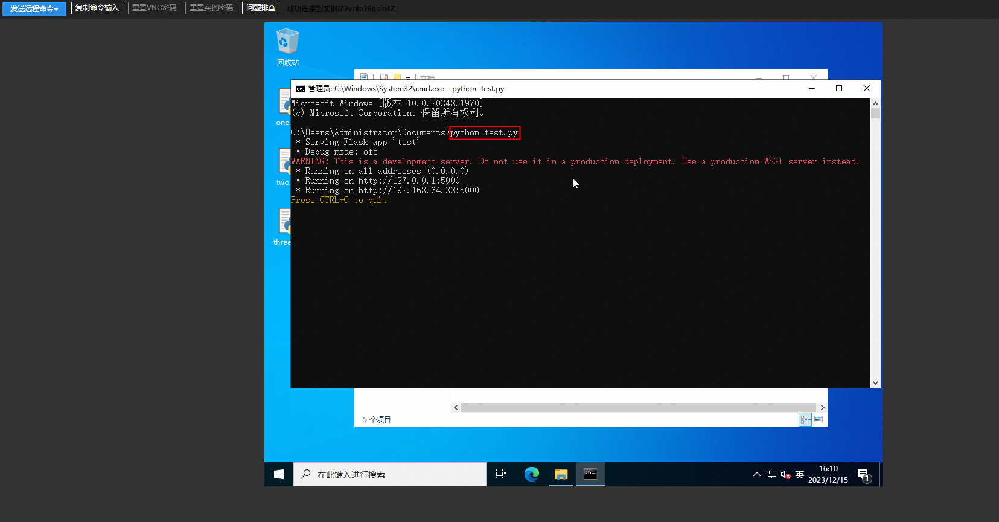

9. 外网访问圣诞图片。

> 在控制台找到实例的公网IP地址，用公网IP地址进行访问。

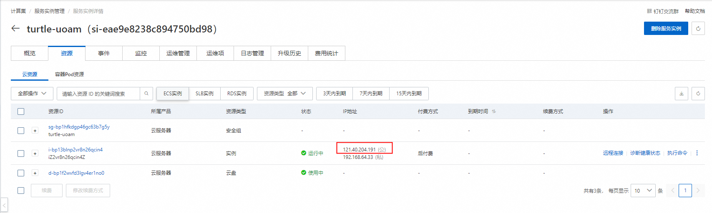
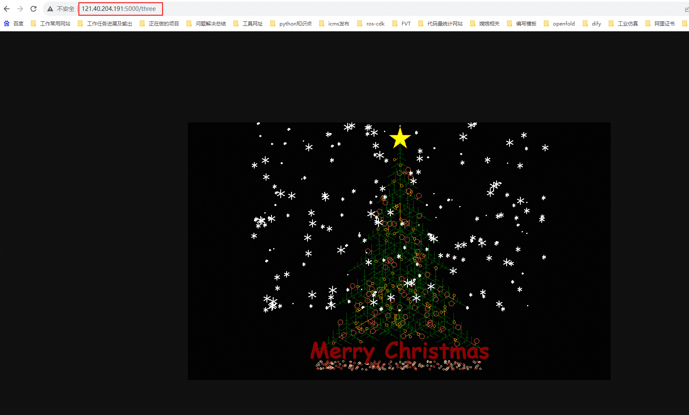
