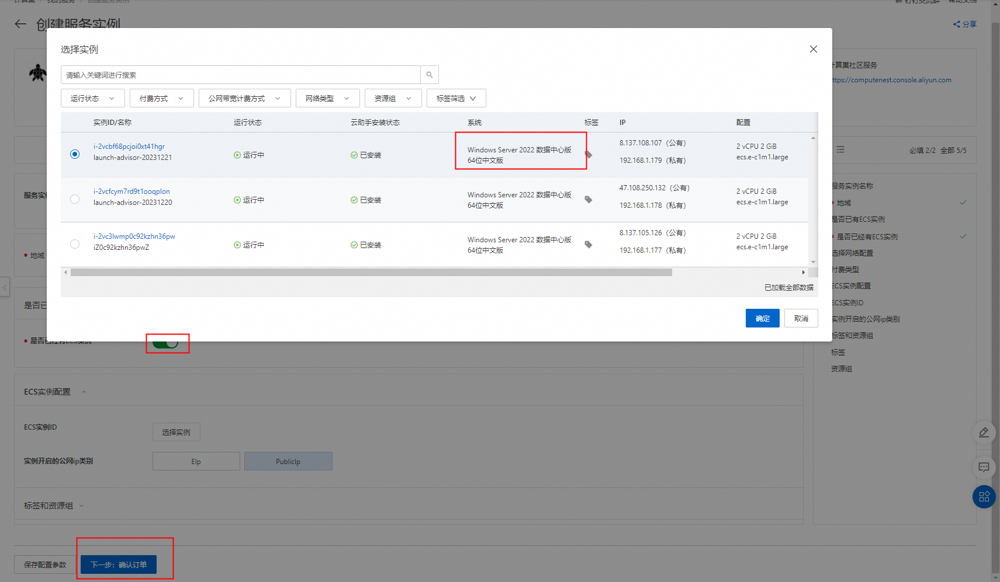
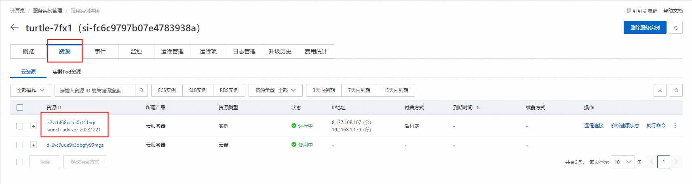
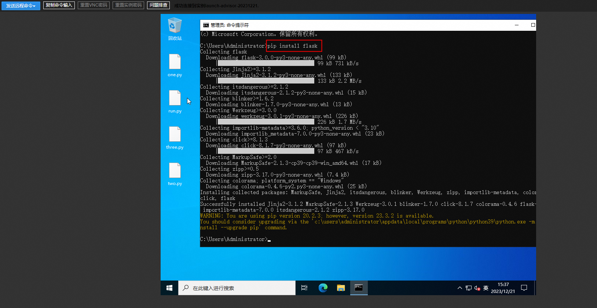
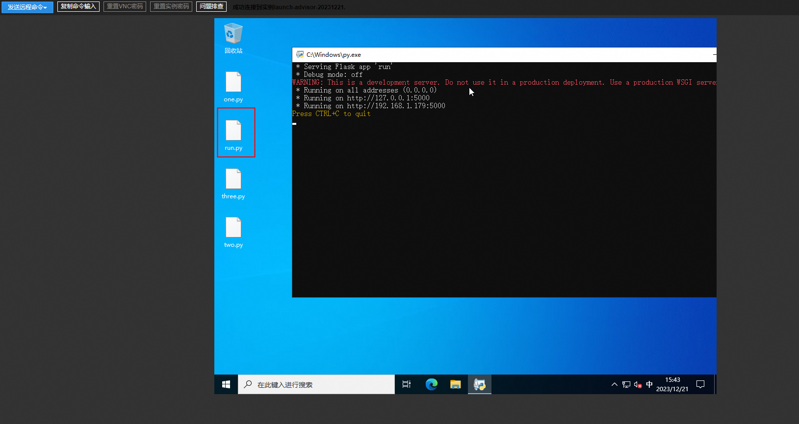
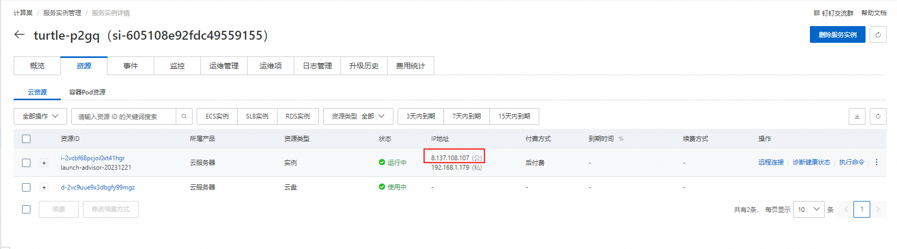
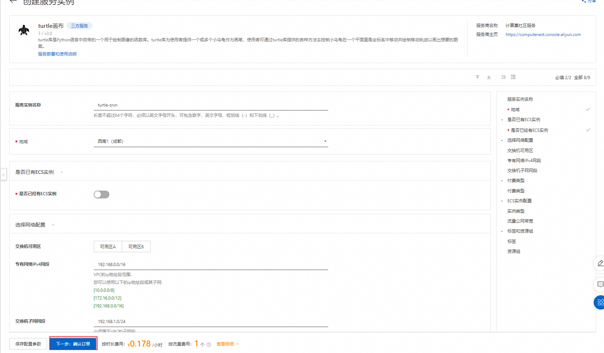
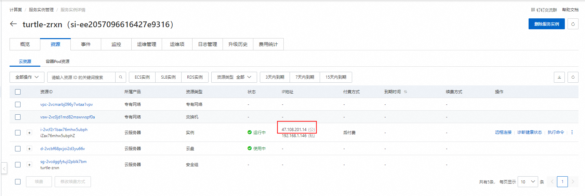
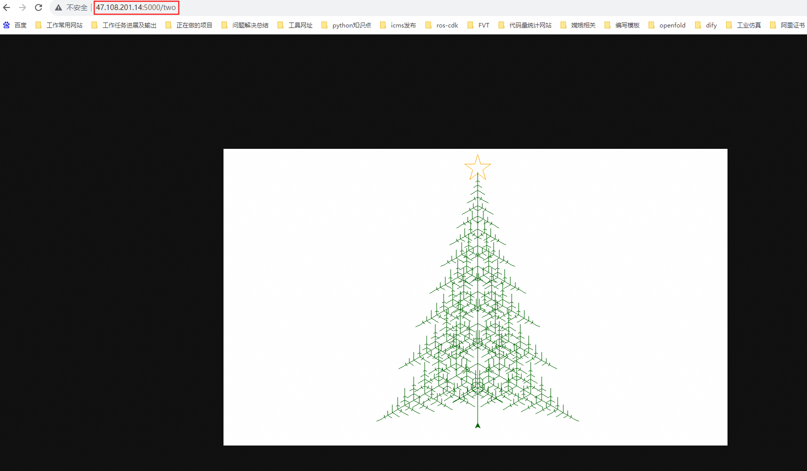

# turtle画布计算巢快速部署

>**免责声明：**本服务由第三方提供，我们尽力确保其安全性、准确性和可靠性，但无法保证其完全免于故障、中断、错误或攻击。因此，本公司在此声明：对于本服务的内容、准确性、完整性、可靠性、适用性以及及时性不作任何陈述、保证或承诺，不对您使用本服务所产生的任何直接或间接的损失或损害承担任何责任；对于您通过本服务访问的第三方网站、应用程序、产品和服务，不对其内容、准确性、完整性、可靠性、适用性以及及时性承担任何责任，您应自行承担使用后果产生的风险和责任；对于因您使用本服务而产生的任何损失、损害，包括但不限于直接损失、间接损失、利润损失、商誉损失、数据损失或其他经济损失，不承担任何责任，即使本公司事先已被告知可能存在此类损失或损害的可能性；我们保留不时修改本声明的权利，因此请您在使用本服务前定期检查本声明。如果您对本声明或本服务存在任何问题或疑问，请联系我们。

## 概述

turtle库是Python语言中自带的一个用于绘制图像的函数库。turtle库为使用者提供一个或多个小乌龟作为画笔，使用者可通过turtle库提供的各种方法去控制小乌龟在一个平面直角坐标系中移动并绘制移动轨迹以画出想要的图案。

## 计费说明

turtle画布上的费用主要涉及：

- 所选vCPU与内存规格
- 系统盘类型及容量
- 公网带宽

## 部署架构

## RAM账号所需权限

部署turtle画布服务实例，需要对部分阿里云资源进行访问和创建操作。因此您的账号需要包含如下资源的权限。
  **说明**：当您的账号是RAM账号时，才需要添加此权限。

| 权限策略名称                          | 备注                     |
|---------------------------------|------------------------|
| AliyunECSFullAccess             | 管理云服务器服务（ECS）的权限       |
| AliyunVPCFullAccess             | 管理专有网络（VPC）的权限         |
| AliyunROSFullAccess             | 管理资源编排服务（ROS）的权限       |
| AliyunComputeNestUserFullAccess | 管理计算巢服务（ComputeNest）的用户侧权限 |

## 已有ECS实例部署流程

1. 访问计算巢turtle画布[部署链接](https://computenest.console.aliyun.com/service/instance/create/cn-hangzhou?spm=5176.24779694.0.0.2dc44d22bKq8lF&type=user&ServiceId=service-06f25f1b35084a379977)
，选择已有ECS实例选项：

2. 选择windows环境的实例，确认后点击**下一步：确认订单**。

3. 确认订单完成后同意服务协议并点击**立即创建**进入部署阶段。

4. 等待部署完成后进入服务实例管理，选择资源点击实例的资源ID。

5. 通过VNC远程连接机器。

6. 解锁远程页面并登录机器。

7. 安装python环境，检查.py文件是否存在

注意：如果桌面不存在one.py, two.py, three.py, run.py  4个文件，请重新走流程1-6步，实例还是选同样的实例

> 在C:/下找到python的安装包，按照示例勾选安装

> 打开cmd，运行pip install flask命令安装flask

8. 运行python代码画图。

> 在桌面上双击运行one.py, two.py, three.py文件，即可看到代码对应画出的圣诞树。

9. 外网访问圣诞图片。

> 首先打开实例所属安全组入方向的5000端口，然后在桌面上双击运行run.py文件，即可看到开启flask服务，在控制台找到实例的公网IP地址，用公网IP地址进行/one，/two，/three地址的访问。

## 新建ECS实例部署流程

1. 访问计算巢turtle画布[部署链接](https://computenest.console.aliyun.com/service/instance/create/cn-hangzhou?spm=5176.24779694.0.0.2dc44d22bKq8lF&type=user&ServiceId=service-06f25f1b35084a379977)
，按提示填写部署参数完成后可以看到对应询价明细，确认参数后点击**下一步：确认订单**。

2. 确认订单完成后同意服务协议并点击**立即创建**进入部署阶段。

3. 等待部署完成后进入服务实例管理，选择资源点击实例的资源ID。

4. 通过VNC远程连接机器。

5. 解锁远程页面并登录机器。

> 登录机器初始密码为Mima124161，可自行更改。

6. 运行python代码画图。

> 在桌面上双击运行one.py, two.py, three.py文件，即可看到代码对应画出的圣诞树。

7. 外网访问圣诞图片。

> 在桌面上双击运行run.py文件，即可看到开启flask服务，在控制台找到实例的公网IP地址，用公网IP地址进行/one，/two，/three地址的访问。

